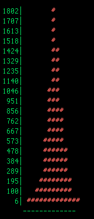
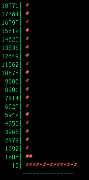
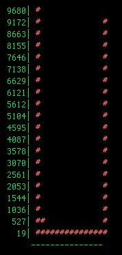

==============================================
Oyster River Strand Exam Tool
==============================================

The Oyster River Strand Exam Tool, which is adapted from the Trinity Strand Examination script (https://github.com/trinityrnaseq/trinityrnaseq/wiki/Examine-Strand-Specificity) can be used as per the following:

```
/path/to/Oyster_River_Protocol/strandeval.mk main \
ASSEMBLY=test.fasta \
READ1=1.subsamp_1.cor.fq \
READ2=1.subsamp_2.cor.fq \
RUNOUT=test
```

This script maps a random 1M reads to the assembly, then plots (plus_strand - minus_strand) / total, which helps us understand the strandedness of the assembly, and if we assembled correctly. Here are the 3 major types of plots you could receive back.

### Assembled Correctly

This plot, showing a somewhat normal distribution, is an example of a *non-strand-specific* library, assembled properly




This plot, showing an extremely biased (can be either left or right side) unimodal distribution, is an example of a *strand-specific* library, assembled properly.



### Assembled Improperly

This plot, showing an extremely biased bimodal distribution, is an example of a *strand-specific* library, assembled in a non-strand specific fashion.


